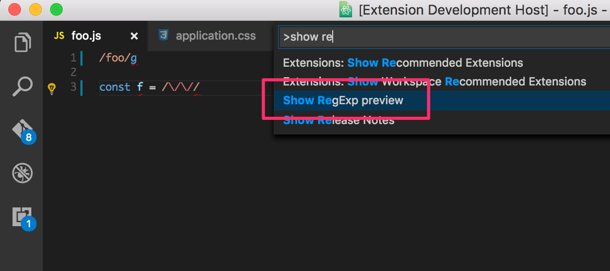
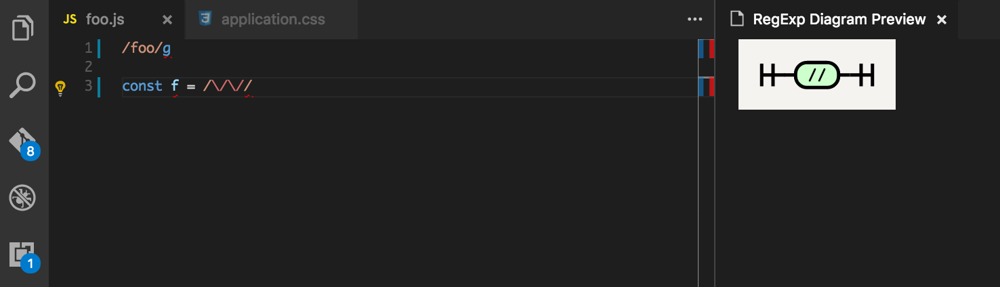

# regex-railroad-diagram package

A regular expression railroad diagram view for regular expression under cursor.
This is inspired by [regex railroad diagrams](https://github.com/klorenz/atom-regex-railroad-diagrams).

It also shows you a parsing error message, if your regex is not syntactically correct.

For now it only supports most common regex features, but there are more to come.
